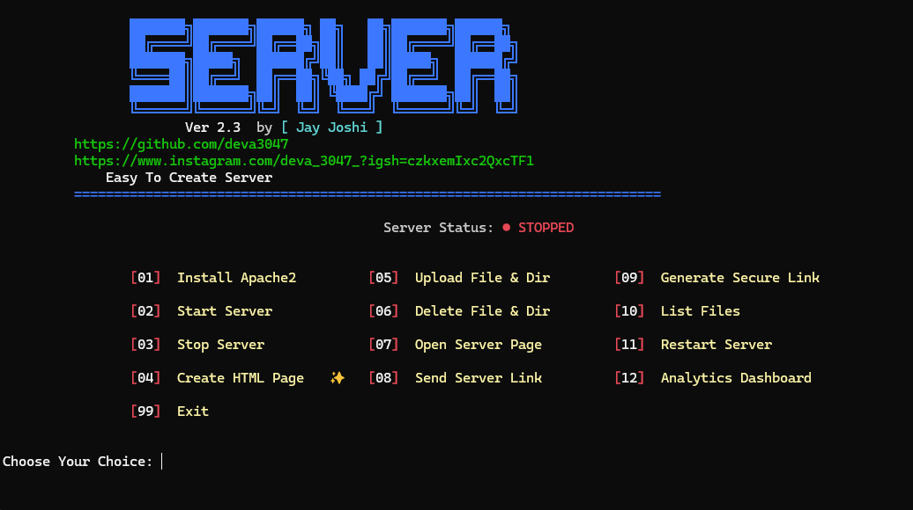

<div align="center">

```
███████╗███████╗██████╗ ██╗   ██╗███████╗██████╗ 
██╔════╝██╔════╝██╔══██╗██║   ██║██╔════╝██╔══██╗
███████╗█████╗  ██████╔╝██║   ██║█████╗  ██████╔╝
╚════██║██╔══╝  ██╔══██╗╚██╗ ██╔╝██╔══╝  ██╔══██╗
███████║███████╗██║  ██║ ╚████╔╝ ███████╗██║  ██║
╚══════╝╚══════╝╚═╝  ╚═╝  ╚═══╝  ╚══════╝╚═╝  ╚═╝
```

# 🖥️ SERVER

**Easy To Create & Manage Your Web Server**


---

**SERVER** is a powerful terminal-based tool that lets you install, manage, and share a local Apache web server in seconds — with built-in file management, HTML page creation, Cloudflare tunneling, and a live analytics dashboard. No config files. No complexity. Just one script.

---

</div>

## ✨ Features

| Feature | Description |
|---|---|
| 🔧 **Install Apache2** | Auto-installs Apache2 using your system package manager |
| ▶️ **Start / Stop / Restart** | Control your server instantly from the menu |
| 🖥️ **HTML Page Creator** | Guided wizard to build & deploy custom HTML pages |
| 📤 **File Upload** | Upload files & directories straight to the web root |
| 🗑️ **File Delete** | Remove files and folders with confirmation prompts |
| 🔒 **Secure Public Link** | Cloudflare tunnel — share your server with anyone online |
| 🔗 **Share Local Link** | Send your LAN IP link to any device on your network |
| 🌐 **Open in Browser** | Launch your server page instantly |
| 📋 **List Files** | View everything inside your web root |
| 📊 **Analytics Dashboard** | Uptime, events, system info & activity history |
| 🔄 **Auto-Fix Filenames** | Spaces in filenames auto-renamed for URL safety |
| 💻 **Cross-Platform** | Works on Linux, Windows (XAMPP/WAMP), Termux (Android) |

---

## 📸 Screenshots

### 🖥️ Main Interface

<div align="center">

<br/>
<sub>Animated ASCII banner with live server status and full menu on startup</sub>
</div>

---

### 🌐 HTML Page Creator

<div align="center">
<table>
<tr>
<td align="center">

<br/><sub><b>Step 1</b> — Enter title, content & style</sub>
</td>
<td align="center">

<br/><sub><b>Step 2</b> — Preview & save to web root</sub>
</td>
</tr>
</table>
</div>

---

### 📤 File Upload

<div align="center">

<br/>
<sub>Upload files & directories to web root — spaces in filenames auto-fixed</sub>
</div>

---

### 🔒 Secure Cloudflare Link

<div align="center">

<br/>
<sub>Instantly generate a public HTTPS URL via Cloudflare tunnel — no port forwarding needed</sub>
</div>

---

### 📊 Analytics Dashboard

<div align="center">

<br/>
<sub>Real-time dashboard — uptime, total events, system info & last 10 activity logs</sub>
</div>

---

## 🛠️ Requirements

**Python 3.6+** — No external packages needed, uses standard library only.

| Platform | What You Need |
|---|---|
| 🐧 **Linux** | `sudo` access · Apache2 (auto-installable via Option 01) |
| 🪟 **Windows** | XAMPP or WAMP installed at `C:\xampp` or `D:\xampp` |
| 📱 **Termux** | `pkg install apache2` |
| ☁️ **Secure Link** | `cloudflared` installed (optional — for Option 09 only) |

---

## 📦 Installation

```bash
# 1. Clone the repository
git clone https://github.com/deva3047/server-tool
cd server-tool

# 2. Run the script
python3 server2.py        # Linux / Termux
python server2.py         # Windows
```

> 💡 **First time?** Select option **`[01]`** from the menu to auto-install Apache2.

---

## 🚀 Usage

```
┌──────────────────────────────────────────────────────────────────────────────┐
│  [01]  Install Apache2          [05]  Upload File & Dir     [09]  Secure Link │
│  [02]  Start Server             [06]  Delete File & Dir     [10]  List Files  │
│  [03]  Stop Server              [07]  Open Server Page      [11]  Restart     │
│  [04]  Create HTML Page ✨      [08]  Send Server Link      [12]  Analytics   │
│  [99]  Exit                                                                   │
└──────────────────────────────────────────────────────────────────────────────┘
```

---

## 📁 Menu Options

<details>
<summary><b>🔧 01 — Install Apache2</b></summary>
<br>
Automatically installs Apache2 using the correct package manager for your platform (<code>apt</code> on Linux, <code>pkg</code> on Termux, or auto-detects XAMPP/WAMP on Windows).
<br><br>
</details>

<details>
<summary><b>▶️ 02 / ⏹️ 03 / 🔄 11 — Start / Stop / Restart Server</b></summary>
<br>
Control the Apache2 service with a single keypress. Live status (<code>● RUNNING</code> / <code>● STOPPED</code>) is always shown at the top of the menu.
<br><br>
</details>

<details>
<summary><b>🖥️ 04 — Create HTML Page ✨</b></summary>
<br>
An interactive wizard walks you through entering a page title, body content, and style preferences — then auto-generates and saves the HTML file directly to your web root.
<br><br>
</details>

<details>
<summary><b>📤 05 — Upload File & Directory</b></summary>
<br>
Upload any file or folder to the web root. Filenames containing spaces are automatically renamed (spaces → underscores) to ensure they work correctly as URLs.
<br><br>
</details>

<details>
<summary><b>🗑️ 06 — Delete File & Directory</b></summary>
<br>
Safely remove files or folders from the web root. Confirmation prompts prevent accidental deletion.
<br><br>
</details>

<details>
<summary><b>🔒 09 — Generate Secure Link</b></summary>
<br>
Uses <code>cloudflared</code> to create a temporary public HTTPS tunnel link — share your local server with anyone on the internet without touching your router or firewall.
<br><br>
</details>

<details>
<summary><b>📊 12 — Analytics Dashboard</b></summary>
<br>
Full dashboard showing:
<ul>
<li>Total link opens, server starts, file uploads & deletions</li>
<li>Tunnel sessions and HTML pages created</li>
<li>Server uptime and last start time</li>
<li>Apache2 and cloudflared installation status</li>
<li>Web root size, folder count, file count</li>
<li>Last 10 events with timestamps</li>
</ul>
Export your analytics to JSON or reset all data from within the dashboard.
<br><br>
</details>

---

## 💻 Platform Support

| Platform | Web Root | Notes |
|---|---|---|
| 🐧 **Linux** | `/var/www/html` | Full support · `sudo` used for file ops |
| 🪟 **Windows** | `C:\xampp\htdocs` | XAMPP / WAMP auto-detected · no sudo |
| 📱 **Termux** | `$PREFIX/.../htdocs` | Full menu · no sudo required |

---

## 📊 Analytics

All events are logged locally to `~/.server_analytics.json`. The dashboard tracks:

```
🔗 Link Opens        🚀 Server Starts       📤 Files Uploaded
🗑️ Files Deleted     🌐 Tunnel Sessions     🖥️ HTML Pages Created
```

> Export to JSON or reset all data directly from the Analytics Dashboard (Option 12).

---

## 👤 Author

<div align="center">

### Jay Joshi

[](https://github.com/deva3047)
[](https://www.instagram.com/deva_3047_?igsh=czkxemIxc2QxcTF1)

*Issues, suggestions, and pull requests are always welcome!*

</div>

---

<div align="center">

**SERVER v2.3** &nbsp;·&nbsp; Made with ❤️ by [Jay Joshi](https://github.com/deva3047)

⭐ **If this tool helped you, please star the repo!** ⭐

</div>
